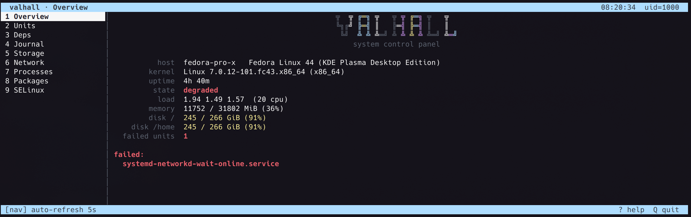

# valhall (v0.2 — Go)

Terminal control panel for a RHEL 8.10-based system. One static binary,
pure Go stdlib (raw termios + ANSI, no ncurses, no external modules).

    go build ./cmd/valhall          # go-toolset >= 1.22
    ./valhall                       # run the TUI
    ./valhall --attach              # SSH-app mode: tmux attach-or-create
    ./valhall --check               # headless load check (CI gate)
    go test ./...                  # parser / trust / quoting tests
    python3 tests/pty_smoke.py     # full keypress gauntlet in a pty

SSH-app install: see contrib/valhall-shell and contrib/sshd_config.d-valhall.conf.
Plugins: executable scripts with a `# valhall-plugin:` header in
/etc/valhall/plugins (root-owned, not group/world-writable) — format
unchanged from v0.1; Python-era plugins load as-is.

Design history and decision records: WORKLOG.html, plus v0.1's PLAN.md.
